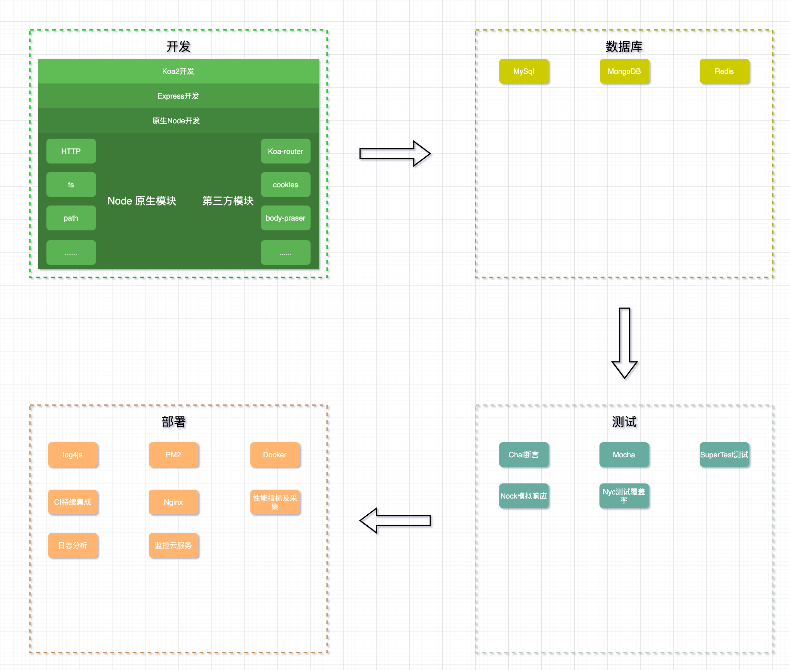
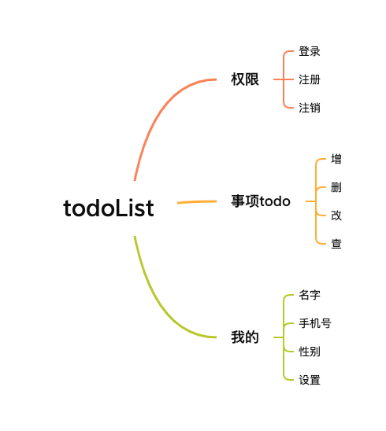

# Node 后台开发
> 一个不会Node的前端不是一个好的产品经理

离职期间除了复习前端知识外，利用空余的时间系统的学习一下`Node`后台开发。该项目将会记录`Node`的一个学习历程，从原生`Node`写一个服务器，再到`Express`、`Koa2`的学习，更加深入的了解`Node`，扩展知识视野，感兴趣的可以点个`Start`关注一下。该系列针对有一些`Node`基础，了解使用过`Node`相关`API(fs、http、url...)` 的同学。

在学习过程中，我会用三种方式来实现一个`TODOList`的简单工具，主要涉及一些简单的API接口，注册、登录、事项增删改查、个人信息修改、设置同步...

## 学习计划

## TODO
- [ ] 原生Node版本
- [ ] Express版本
- [ ] Koa2版本
- [ ] 数据库md编写
- [ ] 测试md编写
- [ ] 部署md编写